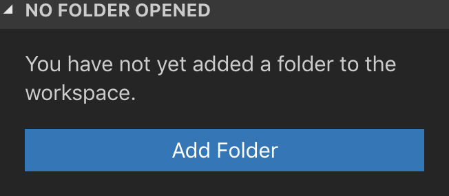
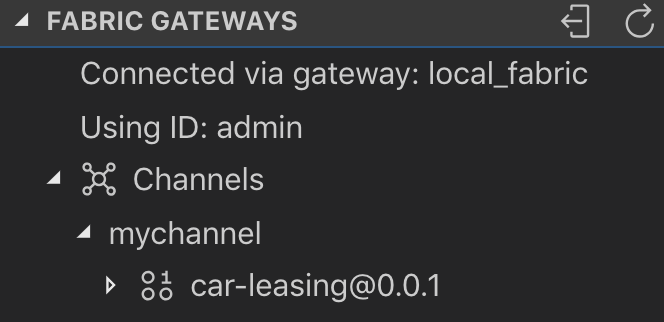
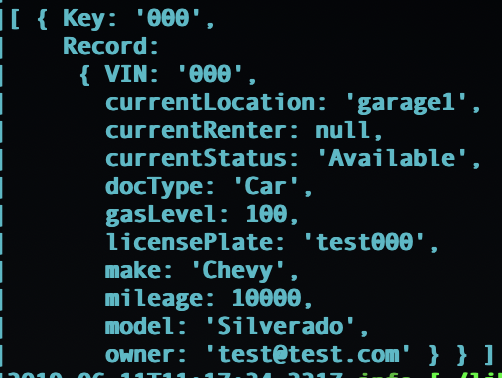

# Car Leasing with Blockchain

In this lab, we will be creating a local Hyperledger Fabric network by using the IBM Blockchain Platform extension for VSCode which makes it easy to start developing smart contracts. 

The solution that we will be working with is a car leasing platform where users can put their own personal cars up for lease to other people. For cars that are in demand, users can make offers on listings and bid against other users.

Additionally, this network can be expanded to include a number of other companies who wish to transact on the netork. This can include:
- Rental car companies who wish to have their cars available to lease on the network.
- Insurance companies who wish to offer temporary insurance policies for drivers 
- local dealerships who wish to showcase cars that are for sale


After completing this lab you will understand how to:
- Utilize the IBM Blockchain Platform extension for VSCode
- Deploy smart contracts to a local Hyperledger Fabric network
- Connect to a Hyperledger Fabric application using the Fabric SDK for Node.js

# Flow
1. The smart contract is deployed to a local Hyperledger Fabric network via the IBM Blockchain Platform extension for VS Code.
2. A car is created and added to the network.
3. Next, a listing is made which makes the car available to be leased.
4. Other users can rent the car at the advertised price or they can make an offer for a lower price.
5. The owner of the car decides to either accept the offer and rent the car to the person that made the offer, or to ignore the offer.
6. Once an offer is accepted and the car is rented, a lease is created that outlines the terms of the rental.
7. As the renter is driving the car around, the car communicates the current location and current gas level readings to the network and the asset in the ledger is updated.
8. In order for the car to be returned, the car must have a gas level equal to or greater than it did from the start. The renter refills gas as needed.
9. Lastly the car is returned and made available for the next renter.

# Prerequisites
- VSCode
- The IBM Blockchain Platform extension for VSCode 


# Starting the local Hyperledger Fabric network
Before we go any further, we need to start our local blockchain network. Luckily for us, there is a plug in for VSCode called the IBM Blockchain Platform extension that allows us to get a network up and running with the push of a button. 

1. Log into the VM that was provided to you by typing in the address in the address bar of the browser and logging in with the password provided.
2. Open the terminal within the VM and enter the word `code` and press enter. This is a shortcut tht will open up VS Code, the code editor that we will be using.
3. From VS Code, click on the IBM Blockchain Platform extension on the left side of the editor. The icon looks like a square as shown below.


3. Hover your mouse over the section labeled **Local Fabric Ops** and click on the three button menu that appers and select **Start Fabric Runtime**


Your local network will then be spun up in docker containers on your machine. We will be using this local networks to deploy our smart contracts to. 


# Creating the Logspout Container
Throughout this workshop we may need to see the output of certain actions against the Hyperledger Fabric network. To see this output we will be implementing a special container called the logspout container. This container will monitor all log output from all containers in a certain docker network. In this case, we can see what each container in our Hyperledger Fabric network is saying which will help with debuging.

1. Clone this repo by navigating to the terminal and entering the following commands:
```bash
cd /home/student/Documents/

git clone https://github.com/odrodrig/carLeasing.git

```

2. Then run the following commands to create the logspout container

```bash

cd carLeasing/configuration/cli/

bash monitordocker.sh
```
3. Keep this terminal window open as we will be checking back to see output throughout the lab

# Packaging chaincode
In order to start using the chaincode we need to package, install, and instantiate it first. 

1. To package the chaincode, first go to the file explorer in Visual Studio Code by clicking on the file icon on the left toolbar.
2. Then, click on the blue button that says **Add Folder**



3. In the new dialog window, find the **contract/** folder in this repo that we cloned earlier and click **Add**. You should now see **contract** appear in the file explorer.
4. Then, click on the IBM Blockchain Platform extension on the left side of VSCode.
5. Find the **Smart Contract Packages** section, hover your mouse over it, and click on the three dot menu. Then select **package a smart contract project**

6. A new package called *car-leasing@0.0.1* should appear under **Smart Contract Packages**.

You now have a smart contract package named **car-leasing** with a version number following it. Everytime you make a change to the smart contract, you must increase the version number in **package.json** and repackage the smart contract.

Now that we have the smart contract packaged we need to install the smart contract onto a peer.

# Installing and Instantiating
Getting the smart contract on to a Hyperledger Fabric network involves two key steps: Install and Instantiate.

Install is simply the process of putting the smart contract onto a peer. Although the peer holds the smart contract, the contract does not execute on the peer. This is where the instantiation process comes in.

Instantiation is performed on a channel by a peer and it is the process of creating a chaincode container to execute logic found in smart contracts. Having the chaincode execute in a separate container ensures security and stability as chaincode execution does not have access to the peer file system and cannot bring the peer down in the event of a crash.

### Installing Chaincode:

1. In the IBM Blockchain Platform extension find the **Local Fabric Ops** section and click on **+ Install**


2. In the prompts that come up select *peer0.org1.example.com*

3. Then select the smart contract that we just packaged which should be *car-leasing@1.0.0*

Your smart contract is now installed. Next we need to instantiate it.

### Instantiate Chaincode

1. Find the **Instantiated** section under **Local Fabric Ops** and click on **+ Instantiate**


2. In the prompt that comes up, select *mychannel*

3. A prompt should appear at the top of VSCode asking which smart contract to instantiate. Select the one that was just installed.
4. The next prompt should ask for a function to call. We will not be calling any function on instantiation so just press enter and then press enter again when asked about if you want to add a private data configuration file.
5. While the smart contract is instantiating you can see how the process is going by checking on the logspout container which should be running in a terminal window.

If there are any errors during instantiation, you can see what went wrong in the logspout container. 

Now we are ready to test out transactions.

# Invoking transactions with the IBM Blockchain Platform VSCode Extension
Another handy function of the IBM Blockchain Platform VSCode extension is the ability to invoke transactions without having to write an application to do so.

1. In the **Fabric Gateways** pane of the IBM Blockchain Platform extension, click on **local_fabric**.

This will allow us to intract with our local network through the eyes of the organization admin user. 

2. Click on **Channels** and then **mychannel** to display the smart contracts that are instantiated on our channel, mychannel. There should only be one, **car-leasing**. Click on it.



3. You should now see a long list of transactions that are defined in the smart contract.

You can right click on a transaction and select **submit transaction** to invoke the transaction in the contract. Once you select **submit transaction** you will be asked for arguments to pass in. You may need to check out the **lib/car-contract.js** file to see what transactions require which arguments.

Let's test out a transaction. Submit the following transaction with the respective arguments:

1. Right click on **createCar** and select **Submit Transaction**
2. When asked for agruments, overwrite the empty array with the following:

```
["000","Chevy","Silverado","test@test.com","test000","10000","100","garage1"]
```

3. Press enter

4. When asked about transient data, just press enter.

5. Next let's query the ledger and see what was added. Right click on the **queryAll** transaction and select **evaluate transaction**. When asked for arguments, press enter.

Check out the terminal window that was tailing the logs in the logspout container to see the results of the query.




# Invoking transactions with the Node SDK
Invoking transactions with the VSCode extension is easy enough but when you want to start building applications there are a few extra steps. In this section we will be invoking the transactions defined in car-contract using the the **fabric-network** module. This is a new module introduced in Hyperledger Fabric 1.4.

In the **application** folder you will find **invoke.js**. This file contains the logic that is needed to invoke transactions but it is incomplete.

1. In your code editor, navigate to this repo and open **application/invoke.js**

This script takes the name of a transaction as an argument and then a switch/case statement determines which transaction to invoke.

Take a look at the first case in the switch/case statement. This case will be evaluated when the argument passed in equals "createCar".

3. Open a new terminal window and enter the following command to navigate to the application directory:

```bash
cd /home/student/Documents/carLeasing/application/
```

4. Then install the application dependencies by running the following command:

```bash
npm install
```

5. Invoke the creatCar transaction by running the following command:

```bash
node invoke.js createCar
```

The transaction should complete sucessfully. Take a look at the logspout container to see the output of that transaction.

6. The next step is to create a listing but if you go back to the code editor and take a look at the second case for createListing, you will notice that it is incomplete. 

7. First, reference the structure of the submitTransaction method for the createCar case. Next, take note of the parameters that the createListing requires. You can see this by switching to the /lib/car-contract.js file in this repo and finding the createListing transaction.

8. Complete the rest of the submitTransaction invocation for createListing by filling in the correct parameters as called for in the car-contract file for a listing with the following properties:

- listingID: L-001
- VIN: 123
- owner: john@test.com
- price: 15

When done, your submitTransaction invocation should look like the line below:

```
let createListingResponse = await contract.submitTransaction('createListing', "Li-001","123","john@test.com","15");
```

4. Save the file
5. Run **invoke.js** with the following command

```
node invoke.js createListing
```

6. Take a look at the output of the createListing transaction in the logspout container. You should see the newly created listing.

7. Invoke the following transactions by following the same pattern of:
```bash
node invoke.js "transaction name"
```

- makeOffer
- acceptOFfer
- updateLocation
- refillGas
- returnCar

# Query the World State
To query the world state database there are two transactions that we can use to help us out: queryByField and queryAll.

**queryByField** does just what it says. It queries the world state and only returns assets that match the values for a field such as "docType", "owner", or "VIN". For example, we can use this file to get all assets of docType "Car" or the car with VIN "123".

**queryAll** also does what it says. It returns everything in the world state.

**Note**: This query capability is only available on networks implementing CouchDB as the world state database.

Take a look at **invoke.js** in the code editor again and go down to the case for "queryAll"

Notice how instead of "submitTransaction()" we are calling "evaluateTransaction". The difference between the two is that when you submit a transaction it goes through the endorsement, ordering, and comitting process to be added to the ledger. This is the method that you will be calling for most transaction invocations.

When you evaluate a transaction, you simulate the transaction and get the proposed response but the transaction is not committed to the ledger and does not write to the world state database. This method is used for query operations.

8. Run the following command to query everything in the ledger:
```bash
node invoke.js queryAll
```

Take a look at the contents of the world state in the logspout container. As mentioned before, this view gives us absolutely everything in the ledger. But what if we only want to see the car assets?

9. To see only the car assets we will be calling the queryByField transaction. Take a look at the evaluateTransaction line in invoke.js for queryByField. The first argument that we pass in to the transaction is the field that we want to filter on and the second argument is the specific value that we are looking for.

10. Run the following command to query for car assets:

```
node invoke.js queryByField
```

Take a look at the car asset that was returned in the logspout container.

**Optionally**: Change up the values in the invoke.js file to create additional cars and run through different scenarios. 

# Recap
In this lab we did a lot. First we created a virtual device with Node-Red and then configured the IBM Watson IoT Platform and received API credentials. Next we created the logspout container to monitor logs from our Hyperledger Fabric network. After that, we packaged, installed, and instantiated a smart contract on our local Hyperledger Fabric network. This allowed us to test out some of our transactions using the VSCode plugin. Once we were done testing out the transactions we decided to import some identities and start invoking transactions with the Node SDK. Then, we started the local IoT app to start listening for scan events which we then began to send from our Node-Red app. Finally, we queried the world state database using two different query programs.

## License

This code is licensed under the Apache License, Version 2. Separate third-party code objects invoked within this code pattern are licensed by their respective providers pursuant to their own separate licenses. Contributions are subject to the [Developer Certificate of Origin, Version 1.1](https://developercertificate.org/) and the [Apache License, Version 2](https://www.apache.org/licenses/LICENSE-2.0.txt).

[Apache License FAQ](https://www.apache.org/foundation/license-faq.html#WhatDoesItMEAN)
